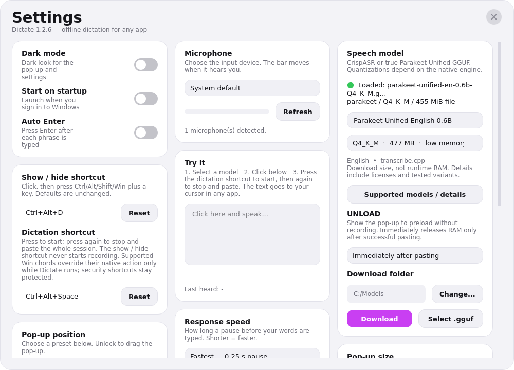
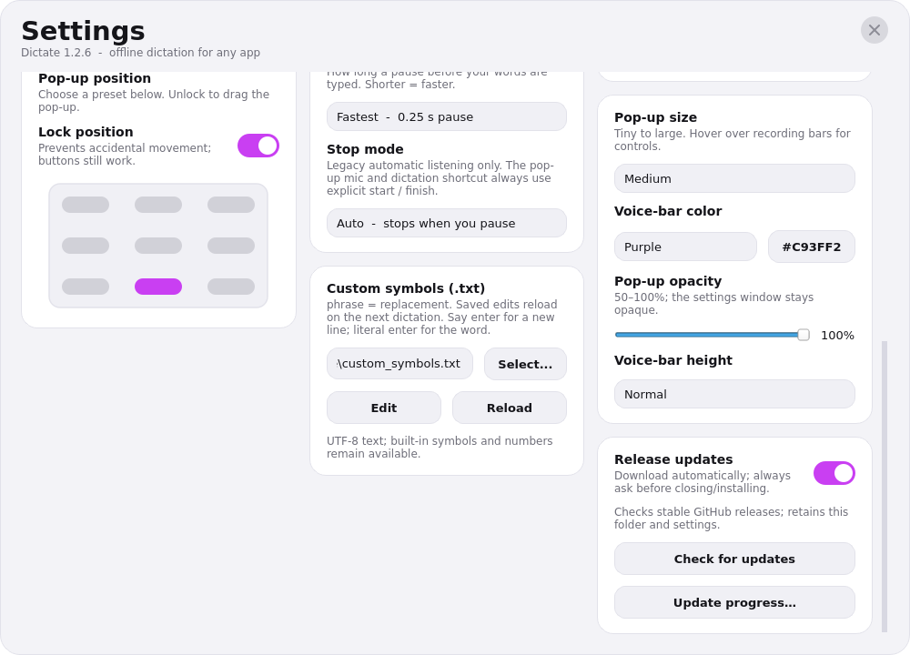
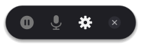
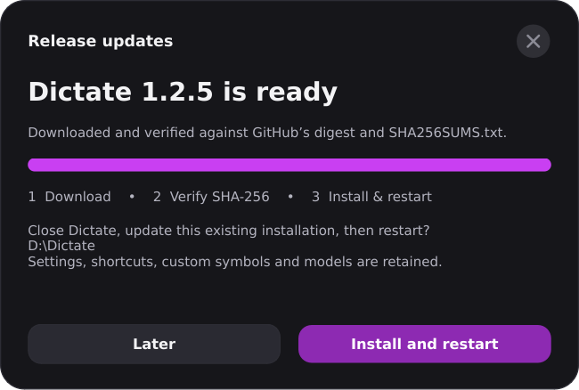
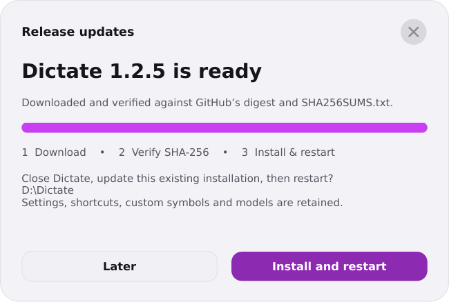
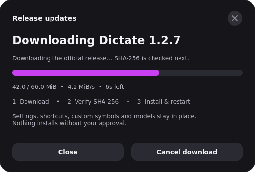
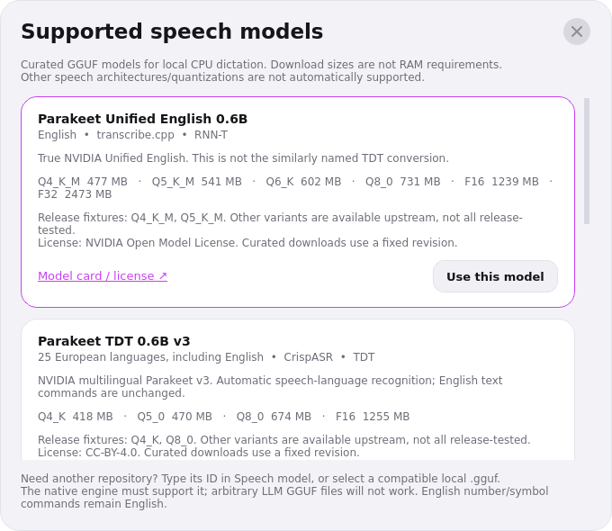

<p align="center">
  
</p>
<h1 align="center">Dictate</h1>
<p align="center"><strong>Your voice. Your words. Your computer.</strong></p>
<p align="center">Fast, offline dictation for Windows, powered by NVIDIA Parakeet.</p>
<p align="center">
  <a href="https://github.com/Comet-Suite/dictate-desktop/releases/latest"></a>
  <a href="LICENSE"></a>
  <a href="https://github.com/Comet-Suite/dictate-desktop/actions/workflows/windows-release.yml"></a>
</p>

---

Dictate turns speech into text in the application you are already using. Click into a text box, start a recording, speak naturally, and stop when you are done. Your complete message is inserted in one operation—not a stream of simulated keystrokes.

**Audio stays on your computer. No dictation account or cloud transcription service is required.**

## Why Dictate

- **Local speech recognition.** True Parakeet Unified English 0.6B support alongside compatible CrispASR GGUF models.
- **Less waiting after long recordings.** Background transcription processes speech while you speak. Nothing is inserted before you stop.
- **Smooth, complete insertion.** One bulk paste per recording, with an optional single Enter. Pauses never submit your shortcut recording.
- **Automatic numbers.** “twenty” becomes `20`, “five zero” becomes `50`, and “zerozerofive” becomes `005`. Long digit sequences keep their leading zeros without a fixed conversion-length cutoff.
- **Natural amounts and symbols.** Say “four hundred dollars” or “400 rupees”; get `$400` or `₹400`. Percentages, numeric expressions, spoken email addresses, and 167 explicit symbols are supported.
- **Two independent global shortcuts.** One controls pop-up visibility; the other starts and commits dictation.
- **Editable custom symbols.** Map spoken phrases to literal symbols/text in a UTF-8 `.txt` file; save and reload without rebuilding. Say “enter” for a newline in the text.
- **Memory on demand.** One unload choice: 5/10/15 idle minutes, Never, or Immediately after pasting. Show the popup to preload without recording; unloading closes the native model worker.
- **Consent-based updates.** Download and verify newer stable releases automatically, then ask before an in-place installation and restart.
- **A compact desktop companion.** Five popup sizes, a saved position lock, voice-bar colors/heights, opacity, light/dark settings and model downloads.

<p align="center"></p>

## New in 1.2.5: a steadier, more personal popup

- **Position lock is on by default.** It prevents accidental dragging without disabling the microphone, pause, settings or close controls. Use **Settings → Pop-up position** to choose a preset, or unlock, drag and lock again. The lock and custom position are saved.
- **Tiny and Extra small** join the unchanged Small, Medium and Large sizes. The capsule and four controls are retained, with at least 22-pixel hit targets at the smallest size.
- **Voice-bar color:** Purple, Blue, Green, Amber, or a custom color. **Opacity:** 50–100%. **Voice-bar height:** Subtle, Normal or Taller. Changes apply live and are saved in the existing settings file.
- **One UNLOAD dropdown**, in this order: **5 minutes idle → 10 minutes idle → 15 minutes idle → Never → Immediately after pasting**. It replaces the two lifecycle switches and manual unload control. Opening the popup still preloads the selected model without recording.

<p align="center"></p>
<p align="center">Tiny &nbsp;  &nbsp; Extra small &nbsp; </p>

The supplied logo, three-column settings layout, dictation pipeline, both shortcuts, Auto Enter preference, model catalog, startup registration, updater security and readable **1.2.4** update palettes are retained. [Release history →](CHANGELOG.md)

### Readable updates retained

The updater uses explicit active/inactive/disabled palettes in both themes, including when Windows/Qt supplies conflicting colors. Real rendering checks enforce a 4.5:1 small-text/button contrast floor against deliberately black-on-black and white-on-white inherited palettes. Installation still requires **Install and restart** consent.

<p align="center"><br></p>
<p align="center"><em>Interface previews captured without microphone input or an installation.</em></p>

## Install on Windows

1. Open the **[latest release](https://github.com/Comet-Suite/dictate-desktop/releases/latest)**.
2. Download `Dictate-Setup-1.2.5-x64.exe` and run it.
3. Open **Dictate** from the Start menu.
4. In **Settings → Speech model**, download a supported model or select a compatible `.gguf` file.
5. Wait for the model to load, then click into the text box where you want your words.

The installer includes Python and both speech runtimes. **You do not need to install Python separately.** Model weights are downloaded separately and are not included in the installer.

> **Windows security notice:** the installer is not code-signed. SmartScreen may show a warning. Verify the download against `SHA256SUMS.txt` in the release, and only run downloads you trust.

**System:** Windows 10/11, 64-bit x86 processor and a microphone. At least 8 GB RAM is recommended; larger models and quantizations need more memory. Internet access is used for model downloads and optional release checks/downloads, not for local transcription afterwards.

A portable ZIP is also provided. Extract the entire archive before running `Dictate.exe`; do not move the executable out of its folder.

## Updater and model details

<p align="center"></p>
<p align="center"><em>Updater interface preview; transfer values are illustrative, not a claim that a future release exists.</em></p>
<p align="center"></p>

## Start with Windows

Enable **Settings → Start on startup**. Dictate will start automatically when **your Windows account signs in**. This remains opt-in; an existing disabled preference is not changed.

The app checks its saved startup preference on a manual launch. The installer also repairs missing or outdated startup registration during a reinstall or upgrade, even with silent installation. Paths containing spaces are quoted, and the installed executable—not an internal Python file—is registered.

If Windows still prevents startup, check **Windows Settings → Apps → Startup → Dictate** (or Task Manager → Startup apps) and enable it there. Dictate does not bypass Windows startup-app restrictions or administrator policies. Windows can delay startup applications while sign-in completes.

To upgrade an existing **1.2.0** installation, finish dictation, quit Dictate from its tray menu and run the **1.2.5** installer once. Keep your existing **Start on startup** preference enabled. Your settings and model files are retained.

## Record, pause, finish

| Shortcut | Default | Action |
|---|---|---|
| Show / hide | `Ctrl` + `Alt` + `D` | Toggle the floating pop-up; preload its selected model when showing it. No recording. |
| Dictation | `Ctrl` + `Alt` + `Space` | First press: record. Second press: insert the complete recording. |

Both shortcuts are configurable in Settings. Existing two-shortcut settings are preserved. If you used the single-shortcut build, its recording key is retained and the default show/hide key is restored.

1. Put the cursor in the destination text box.
2. Press the **dictation shortcut**.
3. Speak for as long as you need. You can pause without sending anything.
4. Press the same shortcut again.
5. Dictate inserts the assembled text once. **Auto Enter**, if enabled, sends Enter once afterwards.

The microphone and pause controls remain available in the pop-up. Automatic microphone mode is separate from explicit shortcut recordings.

### New lines without sending

Say **“hello enter world”** to insert `hello`, a newline, then `world`. “Enter” is a text command—not an Enter keypress. Say **“literal enter”** for the word. The recording is still assembled and pasted once at Stop. **Auto Enter** remains a separate optional final keypress; leave it off to avoid that action.

### Custom symbols

Use **Settings → Custom symbols (.txt) → Edit** or **Select…**. Add lines such as `happy face = :)` or `work email = name@example.com`, save, and Reload—or just dictate again. Replacements are literal and can contain escaped newlines. [Format, examples and limits →](docs/CUSTOM_SYMBOLS.md)

## Speak naturally

| Say | Result |
|---|---|
| twenty | `20` |
| five zero | `50` |
| zerozerofive / zero zero five | `005` |
| one thousand two hundred and thirty four | `1234` |
| one point zero zero five | `1.005` |
| four hundred dollars | `$400` |
| 400 rupees | `₹400` |
| four hundred rupees and fifty paise | `₹400.50` |
| fifty percent | `50%` |
| two plus two equals four | `2 + 2 = 4` |
| john dot smith at example dot com | `john.smith@example.com` |
| at sign, hash sign, dollar sign | `@#$` |

Number conversion applies to recognized dictation, not to unrelated text you type manually. Spaced or joined digit words are supported; leading and fractional zeros are preserved. Standard English cardinal numbers, including lakh/crore and large English scales, are handled exactly without binary floating-point rounding. Number conversion is performed on the assembled recording before its single paste, so background pieces can form one number. There is no fixed digit-count limit in the converter; available memory, model recognition and the destination application's limits still apply. Already formatted numeric dates, URLs and literal email addresses are preserved.

Natural transformations use context rather than blindly changing every “at”, “plus”, or currency word in normal prose. Recognition still depends on the selected model and microphone. The full explicit symbol vocabulary is in [`docs/SYMBOLS.md`](docs/SYMBOLS.md).

## Choose a model

The picker uses readable names and offers only formats present in that model’s curated revision. **Supported models / details** shows languages, runtime, available downloads, license links and the exact release-test variants.

| Curated model | Language coverage | Runtime | Low-memory starting point |
|---|---|---|---|
| **Parakeet Unified English 0.6B** | English | transcribe.cpp / RNN-T | Q4_K_M · 477 MB |
| **Parakeet TDT 0.6B v3** | 25 European languages, including English | CrispASR / TDT | Q4_K · 418 MB |
| **Orukeet** | 25 European languages, including English | CrispASR / TDT | Q4_K · 402 MB |
| **Phonon-2** | English | CrispASR / TDT | Q4_K · 402 MB |
| **Parakeet Redux** | Multilingual; see model card | CrispASR / TDT | Q4_K · 402 MB |

These are **download sizes, not RAM promises**. Model weights have separate licenses. See **[the full model catalog](docs/MODELS.md)** for repositories, formats, pinned revisions, release fixtures and limitations. English number/symbol commands remain English; listing a multilingual ASR model does not make those commands language-aware.

Curated downloads are pinned to the catalog’s tested revision. A requested quantization is never silently replaced with a different, larger file. Custom repository IDs and compatible local `.gguf` files remain available, but arbitrary speech/LLM GGUF architectures are not automatically supported. Dictate inspects metadata to select the correct native runtime; renaming a file cannot convert it. The loaded status shows architecture, quantization and file size.

### Model memory and preloading

Use **Settings → Speech model → UNLOAD**. There is one timing control, not overlapping switches:

| Choice (shown in this order) | Behavior |
|---|---|
| **5 minutes idle** | Keep the model ready between insertions; unload after at least 5 idle minutes. |
| **10 minutes idle** | The same policy with a 10-minute idle interval. |
| **15 minutes idle** | The same policy with a 15-minute idle interval. |
| **Never** | Keep the selected model loaded until it is replaced or Dictate exits. |
| **Immediately after pasting** | Release model RAM only after a successful complete insertion; the default for new settings. |

Idle timers are checked approximately every 15 seconds. Recording, speech processing, model loading and queued transcription/paste work block unloading. Immediately does not mean unloading on Stop, during insertion, or after empty/failed insertion. Native-worker teardown releases that model process, not every byte used by the Qt application.

Showing the popup with **Show / Hide** or the tray preloads the selected model in the background without starting recording. Hiding it does not load a model. Startup remains lazy; the saved model is not eagerly loaded just because Dictate launches. A model is not repeatedly reloaded while an already-visible popup sits on screen after a paste.

The **dictation shortcut** is separate: it can reload an unloaded model and record after that explicit Start request. Press again during loading to cancel the recording intent. Immediately also turns legacy auto-mode listening off after successful insertion; select an idle interval or Never if you want to keep that model available for continuous use. The small Settings microphone-level monitor is separate from native-model memory.

**Upgrading old settings:** an enabled old *Unload after pasting* switch becomes **Immediately after pasting**. If it was disabled, the old 5/10/15/Never idle choice is kept. An older settings file with only the idle value keeps that value. The obsolete lifecycle keys are removed from the in-memory settings and the next normal preference save writes the single policy; all unrelated/unknown preferences and model files are retained. Popup preloading is now automatic when explicitly showing it.

## Release updates

**Version 1.2.0 must be upgraded manually once; it has no updater.** From 1.2.1 onward, automatic stable-release checks/downloads are on by default and can be switched off. **1.2.3** adds a rounded progress window and Settings progress bar with real transferred bytes, speed/ETA, a separate SHA-256 stage, cancel and retry. After approval, the native installer displays actual installation progress and restarts Dictate. Downloads are SHA-256 checked against both GitHub's asset digest and the release manifest. You are asked before Dictate closes, installs into the existing folder and restarts. Active recording, pending transcription and loading defer the question; settings and model files are retained. Microsoft Store/WindowsApps paths are not overwritten. [Update behavior, verification and limitations →](docs/UPDATES.md)

## Privacy and local data

- Audio is buffered in memory and is not saved as recording files by Dictate.
- Speech recognition runs locally; Dictate does not send audio to a transcription API.
- Optional custom mappings and downloaded update installers are stored under `%APPDATA%\Dictate`; your selected mapping file may be elsewhere.
- Release checks contact the official GitHub repository but do not upload dictation.
- Preferences are stored in `%APPDATA%\Dictate\settings.json`.
- Downloaded models stay in your chosen download folder.
- Text is temporarily placed on the system clipboard for bulk insertion. The previous clipboard is restored when possible, unless you copy something else. **Windows clipboard history or clipboard sync may retain text according to your Windows settings.**
- Error diagnostics, if needed, are written to `%APPDATA%\Dictate\error.log`.

## Run from source

Python 3.12 is used for the Windows release.

```powershell
git clone https://github.com/Comet-Suite/dictate-desktop.git
cd dictate-desktop
py -3.12 -m venv .venv
.\.venv\Scripts\Activate.ps1
python -m pip install -r requirements.txt
pythonw dictate.py
```

The application source remains a **single Python file**. Its logo is embedded, so running `dictate.py` does not require a separate image path.

## Build and verify

```powershell
python -m pip install -r requirements-build.txt
powershell -ExecutionPolicy Bypass -File packaging\build.ps1 -Version 1.2.5
```

See **[Windows build instructions](docs/BUILDING.md)** for Inno Setup prerequisites, smoke tests, dependency notices, and release verification. Tagged releases are built on Windows through GitHub Actions, tested after installation, and published with checksums.

Development checks:

```powershell
python -m pip install -r requirements-dev.txt
python -m pytest -q
python -m ruff check dictate.py --select F,E9
```

Native runtime compatibility and application behavior are tested separately. Physical microphones, keyboard layouts, elevated applications, and third-party text controls can behave differently across systems.

## Troubleshooting

- **The updated app does not open:** quit the running copy from its tray menu first. Dictate prevents duplicate instances.
- **The popup will not drag:** position lock is enabled by default. Unlock it under Pop-up position, or choose a preset without unlocking.
- **The microphone is quiet:** select the correct input device and verify the level meter in Settings.
- **A shortcut does not work:** choose an unused combination; another app may already own it.
- **Text does not paste into a protected application:** test with a normal text editor. Elevated or clipboard-restricted apps may need special permissions or may reject simulated input.
- **The old icon remains pinned:** unpin the old shortcut, launch the installed `Dictate.exe`, and pin that instance again. Windows can cache icons from older shortcuts.
- **Recognition is slow:** try a smaller quantization, keep the model loaded, and reduce competing CPU workloads. Background transcription reduces the post-stop wait but cannot make every model real-time on every processor.

Found a bug? **[Open an issue](https://github.com/Comet-Suite/dictate-desktop/issues/new/choose)** with your Windows version, model, quantization and steps to reproduce. Do not attach tokens, private transcripts or sensitive audio.

## License

Dictate is distributed under **[GNU GPL version 3](LICENSE)**. Bundled dependencies retain their respective licenses; see [`THIRD_PARTY_NOTICES.md`](THIRD_PARTY_NOTICES.md) and the license files included in each Windows package. Model weights are not part of this repository or its installer.
